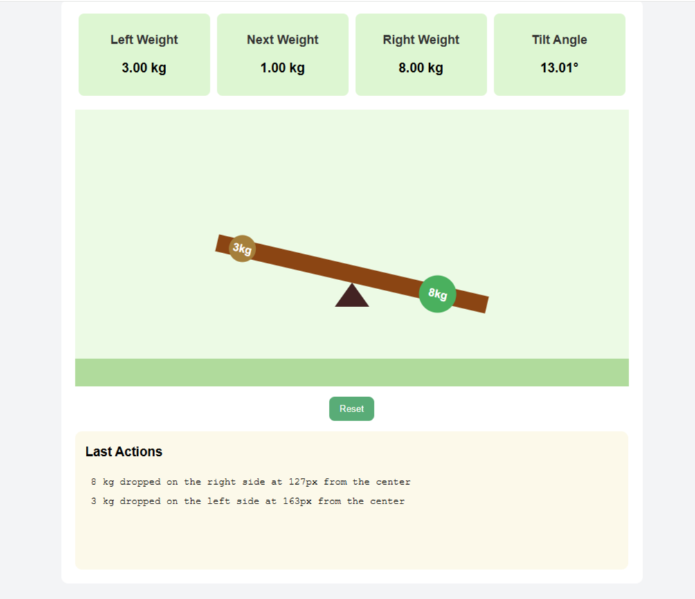

# Seesaw Simulation

An interactive physics-based balance simulation built with Vanilla JavaScript, HTML, and CSS. This simulation visually demonstrates the **Principle of Moments (Torque Balance)** by showing how weights placed on a seesaw affect its tilt angle in real time.




An interactive physics-based balance simulation...


## Project Overview

This simulation allows you to place colored circular weights onto a seesaw. Each weight has a **random mass (1–10 kg)** and position, affecting how the bar tilts according to torque calculations.

The simulation calculates:
- **Left and right torques** based on each weight's position and mass
- **Total torque difference** between both sides
- **Resulting tilt angle** (limited between −30° and +30°)
- **Real-time display** of left weight, right weight, and total tilt

##  Physics Behind the Simulation

### Moment (Torque) Formula
In physics, **torque** (moment) measures the turning effect of a force applied at a distance from a pivot point.

```math
M = F × d
```

**Where:**  
- `M` = Moment (Torque)  
- `F` = Force (weight, proportional to mass × gravity)  
- `d` = Perpendicular distance from the pivot (center of seesaw)

### Balance Condition
A seesaw is in **equilibrium** when:

```math
∑ M_left = ∑ M_right
```

Otherwise, the side with the greater torque tilts downward.

### Tilt Angle Calculation (Simulation Formula)
After summing up the moments on both sides:

```math
totalMoment = M_right - M_left
```

The **tilt angle** is proportional to the torque imbalance:

```math
tiltAngle = totalMoment / 40
```

Then limited to a realistic range:

```math
-30° ≤ tiltAngle ≤ 30°
```

The bar's visual rotation is applied as:

```js
bar.style.transform = `rotate(${tilt}deg)`;
```

##  Features

- **Dynamic Weight Generation**: Random weights (1–10 kg) with random colors and sizes
- **Real-time Physics**: Live torque and tilt calculations
- **Interactive Preview**: Pointer tracking shows where the weight will land
- **Visual Feedback**: Smooth animations using CSS transitions
- **Action History**: Last Actions panel shows recent weight placements
- **Reset Functionality**: One-click reset to clear all weights and restore balance
- **Audio Feedback**: Sound effects for weight drops and resets
- **Responsive Design**: Clean, modern UI with intuitive controls

##  Tech Stack

| Layer | Technology |
|-------|------------|
| **Frontend** | HTML5 |
| **Styling** | CSS3 |
| **Logic & Physics** | Vanilla JavaScript |
| **Animation** | CSS Transitions & Transforms |
| **Audio** | HTML5 Audio API |
| **UI Updates** | DOM manipulation |

##  Getting Started

### Prerequisites
- A modern web browser (Chrome, Firefox, Safari, Edge)
- No additional dependencies required

### Installation
1. Clone the repository:
   ```bash
   git clone https://github.com/burcinozkan/seesaw-simulation.git
   cd seesaw-simulation
   ```
   
   **Alternative:** You can download the project as a ZIP file and extract it.

2. Run the project:
   
   **Method 1 - Direct opening:**
   ```bash
   # Open index.html directly in your browser
   start index.html  # Windows
   open index.html   # macOS
   xdg-open index.html  # Linux
   ```
   
   **Method 2 - With local server:**
   ```bash
   # Using Python
   python -m http.server 8000
   
   # Using Node.js
   npx serve .
   
   # Using PHP
   php -S localhost:8000
   
   # Using Live Server (VS Code extension)
   # Install "Live Server" extension in VS Code and right-click on index.html, then select "Open with Live Server"
   ```

3. Open in your browser:
   - **Direct opening:** Opens with file path (e.g., `file:///C:/Users/username/Desktop/seesaw-simulation/index.html`)
   - **With server:** Navigate to `http://localhost:8000`

##  How to Use

1. **Place Weights**: Move your mouse over the seesaw bar and click to place a weight
2. **Watch Physics**: Observe how the seesaw tilts based on the torque balance
3. **Monitor Values**: Check the status cards for real-time weight and angle information
4. **Track Actions**: View recent weight placements in the Last Actions panel
5. **Reset**: Click the Reset button to clear all weights and restore balance

##  Project Structure

```
seesaw-simulation/
├── index.html          # Main HTML structure
├── script.js           # Physics calculations and interactions
├── styles.css          # Styling and animations
├── sounds/             # Audio files
│   ├── drop.mp3        # Weight drop sound
│   └── reset.mp3       # Reset sound
└── README.md           # This file
```

##  Key Functions

### Physics Engine
- `calculateAngle()`: Computes torque balance and tilt angle
- `randomWeight()`: Generates random weights (1-10 kg)
- `updatePreview()`: Updates weight preview display

### User Interface
- `addLastAction()`: Records weight placement history
- `reset()`: Clears all weights and resets simulation
- `playSound()`: Plays audio feedback

### Event Handling
- Pointer tracking for weight placement preview
- Click detection for weight placement
- Reset button functionality

### Animations
- **CSS Transitions**: Smooth seesaw rotation with `transform: rotate()`
- **Weight Preview**: Real-time preview circle that follows mouse cursor
- **Weight Placement**: Instant visual feedback when weights are dropped
- **Reset Animation**: Smooth transition back to horizontal position (0.5s ease-in-out)
- **Hover Effects**: Button scaling and color changes on interaction

### Audio System
- **Weight Drop Sound**: Plays `drop.mp3` when weight is placed (50% volume)
- **Reset Sound**: Plays `reset.mp3` when reset button is clicked (50% volume)
- **HTML5 Audio API**: Uses `new Audio()` for cross-browser compatibility
- **Volume Control**: Audio levels set to 0.5 for comfortable listening

## Customization

### Modifying Physics Parameters
- **Tilt sensitivity**: Change the divisor in `calculateAngle()` (currently 800)
- **Weight range**: Modify `randomWeight()` function
- **Tilt limits**: Adjust the min/max values in the tilt calculation

### Visual Customization
- **Colors**: Update CSS variables for different themes
- **Animations**: Modify transition durations in `styles.css`
- **Layout**: Adjust dimensions and spacing in the CSS

---
